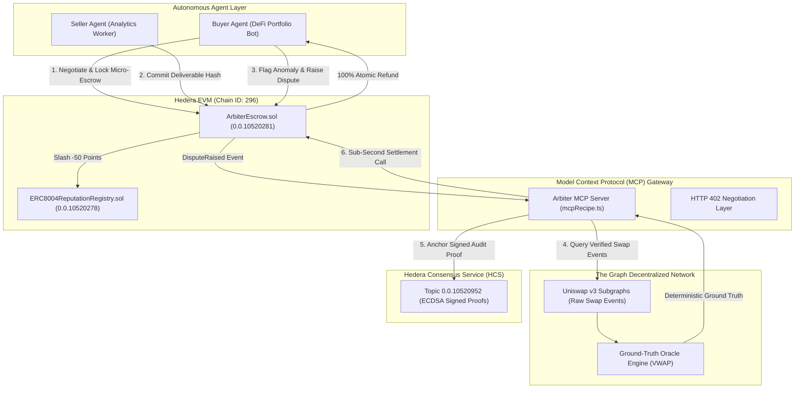
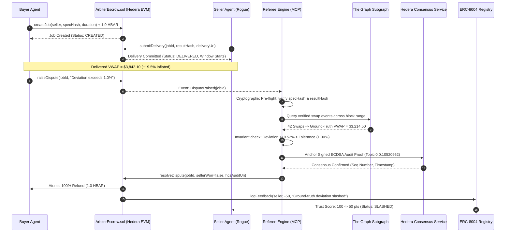

# Arbiter402: Sub-Second Conditional Micro-Escrow & Ground-Truth Adjudication Protocol

> Autonomous, Sub-Second Dispute Settlement and Deterministic Ground-Truth Verification for the Machine Economy.  
> Powered by **Hedera EVM**, **Hedera Consensus Service (HCS)**, **The Graph Decentralized Network**, **Model Context Protocol (MCP)**, and **ERC-8004 Machine Reputation Registry**.

[-00E3A5?logo=hedera&logoColor=white)](https://hashscan.io/testnet)
[](https://sourcify.dev)
[](https://thegraph.com)
[](https://modelcontextprotocol.io)
[](LICENSE)

---

## 📑 Table of Contents
1. [Product Overview & Core Mission](#-product-overview--core-mission)
2. [Why Arbiter402 Matters: The Machine Commerce Problem](#-why-arbiter402-matters-the-machine-commerce-problem)
3. [Core Value Pillars](#-core-value-pillars)
   - [Sub-Second Capital Velocity (Hedera EVM)](#1-sub-second-capital-velocity-hedera-evm)
   - [Zero-Hallucination Adjudication (The Graph)](#2-zero-hallucination-adjudication-the-graph)
   - [Economic Deterrence & Credit Scoring (ERC-8004)](#3-economic-deterrence--credit-scoring-erc-8004)
   - [Permanent Auditable Truth (Hedera Consensus Service)](#4-permanent-auditable-truth-hedera-consensus-service)
   - [Native Agent Interoperability (MCP & HTTP 402)](#5-native-agent-interoperability-mcp--http-402)
4. [Verified Onchain Deployments & Live Evidence](#-verified-onchain-deployments--live-evidence)
5. [Protocol Architecture](#-protocol-architecture)
6. [End-to-End Adjudication Lifecycle](#-end-to-end-adjudication-lifecycle)
7. [Security & Protocol Guarantees](#-security--protocol-guarantees)
8. [Repository Layout](#-repository-layout)
9. [Quickstart & Reproduction Guide](#-quickstart--reproduction-guide)
10. [Command Center Dashboard](#-command-center-dashboard)
11. [API & Interface Reference](#-api--interface-reference)

---

## 💡 Product Overview & Core Mission

**Arbiter402** is the decentralized settlement and dispute arbitration layer built specifically for **autonomous, machine-to-machine commerce**.

In the emerging agentic economy, AI agents negotiate, hire, and pay one another for compute, analytical data, and API tasks without human oversight. However, current financial and blockchain rails were engineered for humans: they assume legal recourse, manual review, or high-friction escrow.

Arbiter402 delivers:
- **Instant Conditional Micro-Escrow**: Programmatic fund locking that releases capital in under a second upon verified delivery.
- **Deterministic Ground-Truth Arbitration**: Elimination of subjective or hallucinated LLM arbitration by evaluating deliverables against mathematical invariants derived directly from decentralized indexed subgraphs.
- **Machine Credit & Reputation**: Persistent onchain reputation tracking that compounds trust for honest agents and economically neutralizes rogue or defective agents through automated slashing.
- **Immutable Consensus Auditability**: Cryptographic proofs anchored to distributed consensus ledgers, providing a permanent public audit trail for every dispute.

---

## 🌐 Why Arbiter402 Matters: The Machine Commerce Problem

```
                        The Machine Commerce Trilemma
                                    ▲
                                   / \
                                  /   \
                                 /     \
         1. Counterparty Risk   /_______\  2. LLM Hallucination Trap
     (Upfront vs Post-Payment)             (Subjective Arbiter Drift)
                                    |
                                    |
                        3. Latency & Gas Friction
                      (Multi-Minute Blocks & High Fees)
```

Autonomous agent-to-agent transactions break down across three systemic failure points:

### 1. The Counterparty Defection Risk
Autonomous software agents cannot be taken to small-claims court, do not possess legal identities, and cannot issue credit card chargebacks. 
- **Upfront Payment**: The buyer agent bears 100% of the risk. A rogue or failing seller agent can hallucinate, return garbage data, or disappear completely.
- **Post-Payment**: The seller agent bears 100% of the risk. A malicious buyer can consume the computed data and refuse to transmit funds.

### 2. The LLM Hallucination Trap (Why LLM-as-a-Judge Fails)
When deliverables are disputed, using an LLM to evaluate another LLM introduces fatal vulnerabilities:
- **Stochastic Drift**: The same prompt can produce differing verdicts across runs.
- **Prompt Injection & Sybil Bribery**: Malicious agents can inject instructions into deliverables to deceive the LLM arbiter.
- **Lack of Ground Truth**: LLMs have no inherent access to verifiable historical truth. They hallucinate plausible-sounding numbers instead of checking mathematical facts.

### 3. Latency & Micro-Transaction Friction
Autonomous agents operate high-frequency micro-workflows: a DeFi portfolio rebalancing agent may request 50 VWAP analytics calculations per hour at $0.10 each.
- Traditional blockchains with 12–60 second block times and multi-dollar gas fees make micro-escrows impossible.
- Agents require **sub-second finality** and **sub-cent transaction fees** to transact continuously without capital lockup.

---

## 🏆 Core Value Pillars

### 1. Sub-Second Capital Velocity (Hedera EVM)
Arbiter402 executes its micro-escrow smart contracts on **Hedera EVM (Chain ID: 296)**:
- **Sub-Second Finality**: Jobs are created, locked, delivered, and settled in **~0.84 seconds**.
- **Micro-Cent Predictability**: Fixed, predictable transaction fees (~**$0.007 USD**) make sub-dollar micro-transactions economically viable.
- **Stateful Challenge Windows**: Every job establishes an automated challenge window upon delivery, guaranteeing the buyer a window to inspect deliverables before capital release.

### 2. Zero-Hallucination Adjudication (The Graph)
Arbiter402 replaces fallible LLM judges with **deterministic mathematical invariant verification** powered by **The Graph's decentralized network**:
- For DeFi analytics (e.g. Volume-Weighted Average Price over block range $[b_{\text{start}}, b_{\text{end}}]$), the referee queries verified onchain swap events directly from The Graph's decentralized subgraphs:
  $$\text{VWAP}_{\text{true}} = \frac{\sum_{i=1}^N (P_i \times V_i)}{\sum_{i=1}^N V_i}$$
- The referee compares the seller agent's submitted deliverable $\mu_{\text{seller}}$ against $\text{VWAP}_{\text{true}}$ using basis points tolerance ($\text{toleranceBps}$):
  $$\delta = \frac{|\mu_{\text{seller}} - \text{VWAP}_{\text{true}}|}{\text{VWAP}_{\text{true}}}$$
- If $\delta > \frac{\text{toleranceBps}}{10000}$, the deliverable is mathematically proven invalid. The verdict is binary, verifiable, and immune to prompt injection.

### 3. Economic Deterrence & Credit Scoring (ERC-8004)
Through [`contracts/ERC8004ReputationRegistry.sol`](contracts/ERC8004ReputationRegistry.sol), Arbiter402 gives AI agents an onchain credit score:
- **Baseline Score**: All agents initialize at `100 points`.
- **Trust Compounding**: Each verified honest delivery awards `+5 reputation points`.
- **Autonomous Slashing**: Delivering defective or fraudulent data triggers an atomic penalty of `-50 points` and increments the onchain slash counter.
- **Mathematical Deterrence**: The expected value of cheating becomes strictly negative:
  $$\mathbb{E}[V] = P(\text{cheat}) \cdot R_{\text{escrow}} - P(\text{dispute}) \cdot C_{\text{slash}} < 0$$
  Agents with low reputation scores are autonomously excluded by buyer agent risk thresholds.

### 4. Permanent Auditable Truth (Hedera Consensus Service)
Every dispute adjudication generates a cryptographically signed audit proof anchored to **Hedera Consensus Service (HCS)** (Topic [`0.0.10520952`](https://hashscan.io/testnet/topic/0.0.10520952)):
- Captures job ID, specification hash, deliverable hash, ground truth value, seller value, error percentage, and the referee's **ECDSA signature**.
- Immutably ordered with nanosecond consensus timestamps, providing permanent third-party verifiability on HashScan without relying on centralized database logs.

### 5. Native Agent Interoperability (MCP & HTTP 402)
- **Model Context Protocol (MCP)**: Implements `@modelcontextprotocol/sdk` tools (`adjudicate_escrow_dispute`, `query_the_graph_ground_truth`, `get_bazantic_recipe_info`), enabling LLM agents in Claude, Cursor, LangChain, and AutoGPT to trigger escrow and dispute resolution natively.
- **HTTP 402 Payment Required**: Standardizes machine payment negotiation via HTTP headers (`X-Escrow-Address`, `X-Escrow-Spec`, `X-Escrow-Amount`), allowing any API endpoint to require conditional micro-escrow before fulfilling requests.

---

## 🔗 Verified Onchain Deployments & Live Evidence

All protocol contracts are deployed on **Hedera Testnet (Chain ID: 296)** and verified on **Sourcify with Exact Match**:

| Component | Hedera Contract ID | EVM Address | HashScan Explorer | Sourcify Verification |
| :--- | :--- | :--- | :--- | :--- |
| **ArbiterEscrow** | `0.0.10520281` | `0x0F7000f78eAa0e0be369A75ac6ADED4654cF3Ae9` | [HashScan Explorer](https://hashscan.io/testnet/contract/0.0.10520281) | [Exact Match (ID: 50400287)](https://sourcify.dev/#/lookup/0x0F7000f78eAa0e0be369A75ac6ADED4654cF3Ae9) |
| **ERC8004ReputationRegistry** | `0.0.10520278` | `0x1F3D8aB86b2Ff573B8723D1356686c37EdaA1359` | [HashScan Explorer](https://hashscan.io/testnet/contract/0.0.10520278) | [Exact Match (ID: 50398499)](https://sourcify.dev/#/lookup/0x1F3D8aB86b2Ff573B8723D1356686c37EdaA1359) |
| **Deployer / Referee Account** | `0.0.10517579` | `0xf9692Fa79ec1E3A78798445E5b720d9bF17E6AA2` | [HashScan Account](https://hashscan.io/testnet/account/0.0.10517579) | Active Referee (~990 HBAR) |
| **Hedera Consensus Service** | `0.0.10520952` | N/A | [HashScan HCS Topic](https://hashscan.io/testnet/topic/0.0.10520952) | Active Audit Trail |

### Live Onchain Settlement Evidence
A complete multi-agent dispute cycle was executed, verified, and settled on Hedera Testnet:
- **Settlement Transaction**: [`0xf34e04b318432ac9b93bfcfb04f056dd697fa7edb0cb6a7c188e51cd86355ccd`](https://hashscan.io/testnet/transaction/0xf34e04b318432ac9b93bfcfb04f056dd697fa7edb0cb6a7c188e51cd86355ccd)
- **Outcome**: Rogue seller submitted `$3,842.10` (+19.52% error against The Graph ground truth `$3,214.50`). Buyer was **100% refunded**, and rogue seller was **slashed by -50 reputation points** onchain.

---

## 🏗️ Protocol Architecture



---

## 🔄 End-to-End Adjudication Lifecycle



---

## 🛡️ Security & Protocol Guarantees

```
+-----------------------------------------------------------------------------+
|                           SECURITY DEFENSE LAYERS                           |
+-----------------------------------------------------------------------------+
| 1. Deliverable Substitution Defense:                                        |
|    onchainJob.specHash == keccak256(spec) &&                                |
|    onchainJob.resultHash == keccak256(deliverable)                          |
+-----------------------------------------------------------------------------+
| 2. Push-Payment Denial-of-Service Defense:                                  |
|    _safeTransfer fallback -> pendingWithdrawals[to] += amount               |
+-----------------------------------------------------------------------------+
| 3. Liveness Safety Valves:                                                  |
|    Buyer ghosting -> claimUncontestedDelivery(jobId) after challengeWindow  |
|    Seller ghosting -> refundExpiredJob(jobId) after deadline                |
+-----------------------------------------------------------------------------+
| 4. Non-Custodial Smart Contract Vault:                                      |
|    Funds locked in immutable EVM logic; no admin backdoor or unilateral pull|
+-----------------------------------------------------------------------------+
```

1. **Deliverable Substitution Defense**: A malicious agent cannot submit a different specification or altered payload during dispute. The referee pre-flight checks enforce that `keccak256(spec)` and `keccak256(deliverable)` strictly match the onchain hashes committed in `ArbiterEscrow.sol`.
2. **Push DoS Immunity**: If a buyer or seller address is a malicious contract that reverts upon receiving native transfers, `_safeTransfer` queues the capital into `pendingWithdrawals` without reverting the dispute resolution.
3. **Liveness Guarantees**:
   - If a buyer goes offline after delivery, the seller calls `claimUncontestedDelivery(jobId)` once `challengeWindow` passes.
   - If a seller goes offline without delivering, the buyer calls `refundExpiredJob(jobId)` once `deadline` passes.
4. **Reentrancy Protection**: All state-modifying transfer functions are guarded with OpenZeppelin `ReentrancyGuard`.

---

## 📁 Repository Layout

```
Arbiter402/
├── contracts/                        # Hedera EVM Smart Contracts
│   ├── ArbiterEscrow.sol             # Sub-second micro-escrow with challenge windows
│   ├── ERC8004ReputationRegistry.sol # ERC-8004 machine reputation & slashing registry
│   ├── interfaces/                   # IArbiterEscrow & IERC8004 interfaces
│   ├── deployments.json              # Verified Hedera Testnet deployment manifest
│   ├── scripts/
│   │   ├── deploy.ts                 # Hardhat deployment script to Hedera EVM
│   │   ├── seedDemo.ts               # End-to-end live Hedera Testnet multi-agent seed
│   │   └── checkTestnet.ts           # Testnet contract and account state inspector
│   └── test/
│       └── ArbiterEscrow.test.ts     # 16 comprehensive unit & security tests (100% passing)
├── referee/                          # Autonomous Adjudicator & Ground-Truth Oracle
│   ├── graphClient.ts                # The Graph decentralized subgraph client (VWAP)
│   ├── adjudicator.ts                # Deterministic mathematical tolerance evaluator
│   ├── hcsLogger.ts                  # Hedera Consensus Service client & ECDSA signer
│   ├── refereeService.ts             # Automated dispute listener & settlement submitter
│   ├── mcpRecipe.ts                  # MCP Recipe Server (@modelcontextprotocol/sdk)
│   ├── inspectGraphAdjudication.ts   # The Graph query & calculation inspector
│   └── inspectMcpRecipe.ts           # MCP tool execution inspector
├── agents/                           # Autonomous AI Agents
│   ├── buyerAgent.ts                 # Escrow funder & deliverable verification agent
│   ├── sellerAgent.ts                # Service provider (honest & rogue calculation modes)
│   ├── runSimulation.ts              # Full 2-round autonomous showdown script
│   └── runInteractiveSim.ts          # Interactive CLI demonstration controller
├── frontend/                         # Next.js 14 Dashboard & Command Center
│   ├── app/                          # App router (page.tsx, layout.tsx)
│   ├── components/
│   │   ├── InteractiveStepper.tsx    # Step-by-step workflow simulator controller
│   │   ├── DisputeTerminal.tsx       # Live comparison: Seller vs The Graph ground truth
│   │   ├── ReputationBoard.tsx       # ERC-8004 reputation table & slashing badges
│   │   ├── EscrowStream.tsx          # Real-time Hedera EVM escrow activity stream
│   │   ├── HcsAuditFeed.tsx          # Live Hedera Consensus Service audit cards
│   │   └── Header.tsx                # Verified contract badges & HashScan links
│   └── lib/mockData.ts               # UI state models and seed dataset
├── hardhat.config.ts                 # Hardhat configuration with Sourcify & Hedera RPC
└── package.json                      # Workspace configuration and execution scripts
```

---

## 🚀 Quickstart & Reproduction Guide

### Prerequisites
- Node.js 18+
- npm or yarn

### 1. Installation
```bash
git clone https://github.com/Blockspade/Arbiter402.git
cd Arbiter402
npm install
npm --prefix frontend install
```

### 2. Run Smart Contract Tests
Execute all 16 unit and security tests covering initialization, deposits, delivery commits, dispute windows, timelocks, pull-payment fallbacks, and ERC-8004 slashing:
```bash
npx hardhat test
```
*Expected: 16 passing in <600ms.*

### 3. Run Autonomous Agent Simulation
Run the full 2-round simulation (Round 1: Honest Delivery with +5 reputation; Round 2: Rogue Delivery with +19.5% divergence $\rightarrow$ The Graph adjudication $\rightarrow$ HCS audit proof $\rightarrow$ ERC-8004 slashing):
```bash
npm run sim
```

### 4. Inspect The Graph Ground-Truth Oracle
Directly inspect the GraphQL query, raw swap ingestion, and mathematical tolerance evaluation:
```bash
npm run inspect:graph
```

### 5. Inspect MCP Recipe Server
Simulate an AI Agent invoking the `adjudicate_escrow_dispute` tool over the Model Context Protocol:
```bash
npm run inspect:mcp
```

### 6. Interactive Terminal Demonstration
Step through the 5-phase adjudication interactively in your terminal:
```bash
npm run sim:interactive
```

---

## 🖥️ Command Center Dashboard

The Arbiter402 dashboard provides a real-time command center to inspect live escrows, verify The Graph ground-truth comparisons, and view Hedera HCS proofs.

### Launch the Dashboard
```bash
npm run frontend:dev
```
Open **[http://localhost:3000](http://localhost:3000)** in your browser.

### Key Features:
1. **Interactive Stepper Controller**: Step through the 5-stage adjudication flow (Escrow Lock $\rightarrow$ Delivery $\rightarrow$ Dispute $\rightarrow$ The Graph Oracle $\rightarrow$ HCS Audit & Settle) in both **Honest Flow** and **Rogue Slash Flow**.
2. **Dispute Adjudication Terminal**: Live side-by-side comparison between Seller Agent output (`$3,842.10`) and The Graph decentralized benchmark (`$3,214.50`), highlighting the +19.52% error against 1.00% tolerance.
3. **ERC-8004 Reputation Board**: Live trust scores reflecting onchain slashing from `100` down to `50 points`.
4. **Live Micro-Escrow Stream**: Tabular feed of Hedera EVM conditional deposits with status badges (`CREATED`, `DELIVERED`, `DISPUTED`, `REFUNDED`, `RESOLVED`).
5. **HCS Audit Feed**: Consensus sequence numbers, timestamps, and direct clickable links to Hedera HashScan.

---

## 📖 API & Interface Reference

### Model Context Protocol (MCP) Tools
| Tool Name | Parameters | Description |
| :--- | :--- | :--- |
| `adjudicate_escrow_dispute` | `jobId`, `poolAddress`, `startBlock`, `endBlock`, `metric`, `toleranceBps`, `sellerValue` | Queries The Graph, runs invariant checks, anchors signed ECDSA proof to Hedera HCS, and calculates reputation delta. |
| `query_the_graph_ground_truth` | `poolAddress`, `startBlock`, `endBlock`, `metric` | Direct access to verified subgraph metrics for autonomous agent verification. |
| `get_bazantic_recipe_info` | None | Returns full MCP recipe schema, supported pools, and network endpoints. |

### Smart Contract Functions (`ArbiterEscrow.sol`)
| Function | Access | Description |
| :--- | :--- | :--- |
| `createJob(address seller, bytes32 specHash, uint256 duration)` | Public (Payable) | Locks native micro-escrow with duration and deliverable specification hash. |
| `submitDelivery(uint256 jobId, bytes32 resultHash, string deliveryUri)` | Seller Only | Commits deliverable hash and starts challenge window. |
| `confirmDelivery(uint256 jobId)` | Buyer Only | Buyer accepts deliverable; releases payout and awards +5 reputation. |
| `raiseDispute(uint256 jobId, string reason)` | Buyer Only | Flags deliverable as defective within challenge window. |
| `resolveDispute(uint256 jobId, bool sellerWon, string auditLogUri)` | Referee Only | Settles dispute based on The Graph ground truth; executes refund or payout and triggers ERC-8004 slashing. |
| `claimUncontestedDelivery(uint256 jobId)` | Seller Only | Safety valve: releases funds to seller if challenge window expires without dispute. |
| `refundExpiredJob(uint256 jobId)` | Buyer Only | Safety valve: refunds buyer if seller fails to submit before deadline. |
| `claimPendingWithdrawal()` | Public | Pull-payment queue for addresses that failed direct transfer. |

---

## 📄 License
This project is open-source software licensed under the [MIT License](LICENSE).
