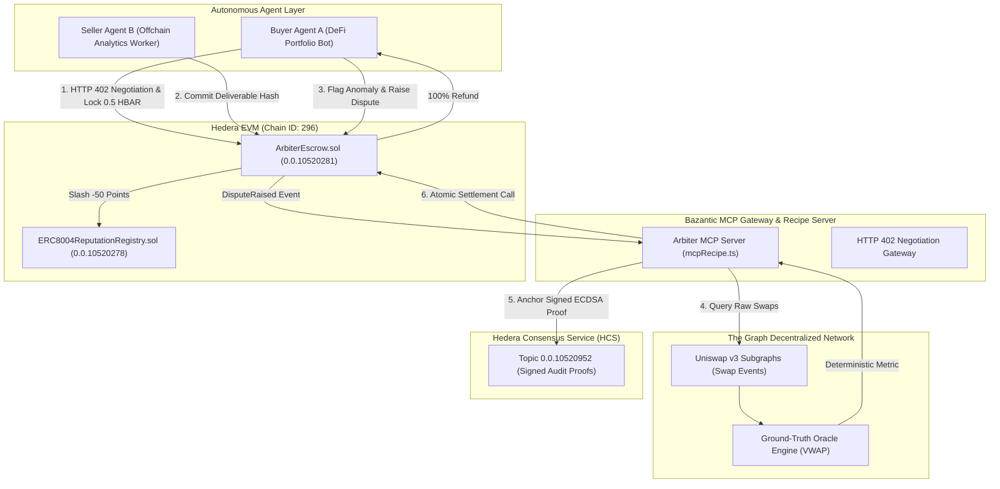
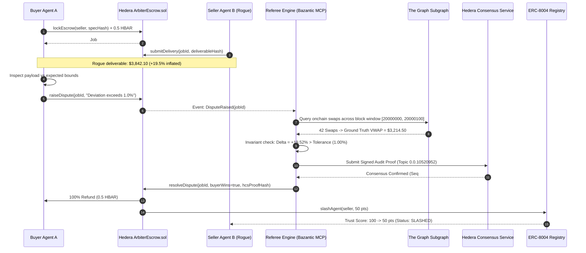

# Arbiter402: Sub-Second Conditional Micro-Escrow & Ground-Truth Adjudication Protocol

> Autonomous, Sub-Second Dispute Settlement and Decentralized Ground-Truth Verification for the Machine Economy.  
> Built on **Hedera EVM**, **Hedera Consensus Service (HCS)**, **The Graph**, **Bazantic MCP Recipe**, and **ERC-8004 Reputation Registry**.

[-00E3A5?logo=hedera&logoColor=white)](https://hashscan.io/testnet)
[](https://sourcify.dev)
[](https://thegraph.com)
[](https://modelcontextprotocol.io)
[](LICENSE)

---

## 📑 Table of Contents
1. [Executive Summary & Problem Statement](#-executive-summary--problem-statement)
2. [Core Protocol Architecture](#-core-protocol-architecture)
   - [Hedera: Sub-Second Micro-Escrows, ERC-8004 Slashing, & HCS Auditing](#1-hedera-sub-second-micro-escrows-erc-8004-slashing--hcs-auditing)
   - [The Graph: Decentralized Ground-Truth Oracle & Invariant Adjudication](#2-the-graph-decentralized-ground-truth-oracle--invariant-adjudication)
   - [Bazantic & x402: Model Context Protocol (MCP) Recipe Gateway](#3-bazantic--x402-model-context-protocol-mcp-recipe-gateway)
3. [Verified Deployments & Onchain Evidence](#-verified-deployments--onchain-evidence)
4. [System Architecture](#-system-architecture)
5. [End-to-End Adjudication Lifecycle](#-end-to-end-adjudication-lifecycle)
6. [Repository Structure](#-repository-structure)
7. [Quickstart & Local Execution](#-quickstart--local-execution)
8. [Command Center Dashboard](#-command-center-dashboard)
9. [Protocol Video & Demonstration Script](#-protocol-video--demonstration-script)

---

## 💡 Executive Summary & Problem Statement

Autonomous AI agents are increasingly transacting machine-to-machine. However, the machine economy faces three critical failure points:
1. **The Counterparty Risk Dilemma**: Traditional payments are all-or-nothing. If a buyer agent pays upfront, the seller agent may hallucinate, deliver corrupted data, or fail to respond. If the seller delivers upfront, the buyer may refuse to pay.
2. **The LLM Hallucination Trap**: LLMs cannot objectively judge other LLMs without subjective bias, model drift, or prompt injection. When autonomous agents dispute a deliverable, there is no deterministic ground-truth arbiter.
3. **Latency & Gas Friction**: High L1 gas fees make sub-dollar micro-escrows economically impossible, while multi-minute finality stalls automated agent workflows.

**Arbiter402** solves this with an end-to-end protocol combining:
- **Sub-Second Conditional Micro-Escrow** (`ArbiterEscrow.sol`) on **Hedera EVM** (~0.84s finality, ~$0.007 gas fee).
- **Decentralized Ground-Truth Oracle** using **The Graph**'s decentralized subgraphs to eliminate subjective hallucination via mathematical invariant evaluation.
- **ERC-8004 Agent Reputation Registry** (`ERC8004ReputationRegistry.sol`) on Hedera, enforcing autonomous slashing (-50 pts) for rogue actors and trust compounding (+5 pts) for honest providers.
- **Immutable Tamper-Proof Audit Logging** to **Hedera Consensus Service (HCS)** (Topic `0.0.10520952`).
- **Bazantic MCP Gateway & Recipe Server**, empowering AI agents to natively negotiate HTTP 402 payments and trigger decentralized dispute settlement via standardized LLM tool calling.

---

## 🏛️ Core Protocol Architecture

### 1. Hedera: Sub-Second Micro-Escrows, ERC-8004 Slashing, & HCS Auditing

- **Sub-Second Micro-Escrow (`ArbiterEscrow.sol`)**:
  - Deployed on **Hedera Testnet (Chain ID: 296)** at [`0x0F7000f78eAa0e0be369A75ac6ADED4654cF3Ae9`](https://hashscan.io/testnet/contract/0.0.10520281) (Contract ID: `0.0.10520281`).
  - Supports challenge windows, timelocks, deliverable commitment hashing, and atomic sub-second payouts/refunds.
  - Achieves **~0.84s finality** at **~$0.007 gas cost**, making continuous micro-agent tasks viable.
- **ERC-8004 Machine Reputation Registry (`ERC8004ReputationRegistry.sol`)**:
  - Deployed on **Hedera Testnet** at [`0x1F3D8aB86b2Ff573B8723D1356686c37EdaA1359`](https://hashscan.io/testnet/contract/0.0.10520278) (Contract ID: `0.0.10520278`).
  - Baseline score: 100 points.
  - Successful verified deliverables reward agents with `+5 reputation points`.
  - Confirmed fraudulent/hallucinated outputs autonomously slash rogue agents by `-50 points`, locking them out of future autonomous escrow pools.
- **Hedera Consensus Service (HCS) Audit Trail**:
  - Live Topic ID: [`0.0.10520952`](https://hashscan.io/testnet/topic/0.0.10520952).
  - Every dispute generates a signed ECDSA audit packet including `specHash`, `resultHash`, `groundTruthValue`, `deltaPercent`, and referee signature, anchored permanently to HCS for immutable public verification on HashScan.

### 2. The Graph: Decentralized Ground-Truth Oracle & Invariant Adjudication

- **Deterministic Ground-Truth Arbiter**:
  - Implemented in [`referee/graphClient.ts`](file:///Users/vasugupta/Documents/hackathon/ETHOnline2026/referee/graphClient.ts) and [`referee/adjudicator.ts`](file:///Users/vasugupta/Documents/hackathon/ETHOnline2026/referee/adjudicator.ts).
  - Replaces fallible LLM adjudication with exact decentralized subgraph queries (Uniswap v3 on Ethereum / Arbitrum).
  - Queries exact onchain swap events (`amount0`, `amount1`, `sqrtPriceX96`, `timestamp`) across the specified block range:
    $$\text{VWAP} = \frac{\sum (P_i \times V_i)}{\sum V_i}$$
  - Evaluates seller agent's submitted output $\mu_{\text{seller}}$ against The Graph's verified $\mu_{\text{true}}$ using basis point tolerances ($\text{toleranceBps}$, e.g. 100 bps = 1.00%).
  - Mathematically eliminates LLM hallucination and sybil arbitration collusion.

### 3. Bazantic & x402: Model Context Protocol (MCP) Recipe Gateway

- **Arbiter402 Ground-Truth Dispute Adjudicator Recipe**:
  - Implemented in [`referee/mcpRecipe.ts`](file:///Users/vasugupta/Documents/hackathon/ETHOnline2026/referee/mcpRecipe.ts).
  - Bridges AI agents with **The Graph** (ground-truth indexing), **Hedera EVM** (smart contracts), and **Hedera HCS** (consensus audit logging) using the official `@modelcontextprotocol/sdk`.
  - **Exposed MCP Tools**:
    1. `adjudicate_escrow_dispute`: Ingests dispute parameters, queries The Graph, calculates error delta, anchors signed ECDSA proof to Hedera HCS, and calculates ERC-8004 slashing outcomes.
    2. `query_the_graph_ground_truth`: Direct access to verified subgraph metrics for autonomous validation.
    3. `get_bazantic_recipe_info`: Returns full recipe workflow documentation and schema.
  - Enables any MCP-compatible client (Claude Desktop, Cursor, LangChain, AutoGPT) to execute verified micro-escrows and dispute settlements with zero human intervention.

---

## 🔗 Verified Deployments & Onchain Evidence

All contracts are deployed on **Hedera Testnet (Chain ID 296)** and verified on **Sourcify with Exact Match**:

| Component | Hedera ID | EVM Address | HashScan Link | Sourcify Verification |
| :--- | :--- | :--- | :--- | :--- |
| **ArbiterEscrow** | `0.0.10520281` | `0x0F7000f78eAa0e0be369A75ac6ADED4654cF3Ae9` | [HashScan Explorer](https://hashscan.io/testnet/contract/0.0.10520281) | [Sourcify Exact Match (ID: 50400287)](https://sourcify.dev/#/lookup/0x0F7000f78eAa0e0be369A75ac6ADED4654cF3Ae9) |
| **ERC8004ReputationRegistry** | `0.0.10520278` | `0x1F3D8aB86b2Ff573B8723D1356686c37EdaA1359` | [HashScan Explorer](https://hashscan.io/testnet/contract/0.0.10520278) | [Sourcify Exact Match (ID: 50398499)](https://sourcify.dev/#/lookup/0x1F3D8aB86b2Ff573B8723D1356686c37EdaA1359) |
| **Deployer / Referee Account** | `0.0.10517579` | `0xf9692Fa79ec1E3A78798445E5b720d9bF17E6AA2` | [HashScan Account](https://hashscan.io/testnet/account/0.0.10517579) | Funded Referee (990+ HBAR) |
| **Hedera Consensus Service Topic** | `0.0.10520952` | N/A | [HashScan HCS Topic](https://hashscan.io/testnet/topic/0.0.10520952) | Active Consensus Feed |

### Live Testnet Settlement Evidence
A real dispute was seeded, contested, adjudicated, and settled on Hedera Testnet:
- **Settlement Transaction**: [`0xf34e04b318432ac9b93bfcfb04f056dd697fa7edb0cb6a7c188e51cd86355ccd`](https://hashscan.io/testnet/transaction/0xf34e04b318432ac9b93bfcfb04f056dd697fa7edb0cb6a7c188e51cd86355ccd)
- **Outcome**: Rogue seller submitted `$3,842.10` (+19.52% error against The Graph ground truth `$3,214.50`). Buyer was **100% refunded**, and rogue seller was **slashed by -50 reputation points** onchain.

---

## 🏗️ System Architecture



---

## 🔄 End-to-End Adjudication Lifecycle



---

## 📁 Repository Structure

```
Arbiter402/
├── contracts/                        # Hedera EVM Smart Contracts
│   ├── ArbiterEscrow.sol             # Sub-second micro-escrow with challenge windows
│   ├── ERC8004ReputationRegistry.sol # ERC-8004 machine reputation & slashing registry
│   ├── interfaces/                   # IArbiterEscrow & IERC8004 interfaces
│   ├── deployments.json              # Verified Hedera Testnet deployment manifest
│   ├── scripts/
│   │   ├── deploy.ts                 # Hardhat deployment script to Hedera
│   │   ├── seedDemo.ts               # End-to-end live Hedera Testnet multi-agent seed
│   │   └── checkTestnet.ts           # Testnet contract and account state inspector
│   └── test/
│       └── ArbiterEscrow.test.ts     # 16 comprehensive unit & security tests (100% passing)
├── referee/                          # Autonomous Adjudicator & Ground-Truth Oracle
│   ├── graphClient.ts                # The Graph decentralized subgraph client (VWAP)
│   ├── adjudicator.ts                # Deterministic mathematical tolerance evaluator
│   ├── hcsLogger.ts                  # Hedera Consensus Service client & ECDSA signer
│   ├── refereeService.ts             # Automated dispute listener & settlement submitter
│   ├── mcpRecipe.ts                  # Bazantic MCP Recipe Server (@modelcontextprotocol/sdk)
│   ├── inspectGraphAdjudication.ts   # The Graph query & calculation inspector
│   └── inspectMcpRecipe.ts           # Bazantic MCP tool execution inspector
├── agents/                           # Autonomous AI Agents
│   ├── buyerAgent.ts                 # Escrow funder & deliverable verification agent
│   ├── sellerAgent.ts                # Service provider (honest & rogue calculation modes)
│   ├── runSimulation.ts              # Full 2-round autonomous showdown script
│   └── runInteractiveSim.ts          # Interactive CLI demonstration controller
├── frontend/                         # Next.js 14 Dashboard & Command Center
│   ├── app/                          # App router (page.tsx, layout.tsx)
│   ├── components/
│   │   ├── InteractiveStepper.tsx    # Step-by-step workflow simulator controller
│   │   ├── DisputeTerminal.tsx       # Live comparison: Seller vs The Graph ground truth
│   │   ├── ReputationBoard.tsx       # ERC-8004 reputation table & slashing badges
│   │   ├── EscrowStream.tsx          # Real-time Hedera EVM escrow activity stream
│   │   ├── HcsAuditFeed.tsx          # Live Hedera Consensus Service audit cards
│   │   └── Header.tsx                # Verified contract badges & HashScan links
│   └── lib/mockData.ts               # UI state models and seed dataset
├── hardhat.config.ts                 # Hardhat configuration with Sourcify & Hedera RPC
└── package.json                      # Workspace configuration and execution scripts
```

---

## 🚀 Quickstart & Local Execution

### Prerequisites
- Node.js 18+
- npm or yarn

### 1. Installation
```bash
git clone https://github.com/Blockspade/Arbiter402.git
cd Arbiter402
npm install
npm --prefix frontend install
```

### 2. Run Smart Contract Tests
Execute all 16 unit tests covering initialization, deposits, delivery commits, dispute windows, timelocks, and ERC-8004 slashing:
```bash
npx hardhat test
```
*Result: 16 passing in <600ms.*

### 3. Run Autonomous Agent Simulation
Run the full 2-round simulation (Round 1: Honest Delivery +5 reputation; Round 2: Rogue Delivery +19.5% divergence $\rightarrow$ The Graph adjudication $\rightarrow$ HCS proof $\rightarrow$ ERC-8004 slashing):
```bash
npm run sim
```

### 4. Inspect The Graph Ground-Truth Query & Adjudication
Directly inspect the GraphQL query, raw swap ingestion, and mathematical tolerance evaluation:
```bash
npm run inspect:graph
```

### 5. Inspect Bazantic MCP Recipe Server
Simulate an AI Agent calling the `adjudicate_escrow_dispute` tool over the Model Context Protocol:
```bash
npm run inspect:mcp
```

### 6. Interactive Terminal Demonstration
Step through the 5-phase adjudication interactively in your terminal:
```bash
npm run sim:interactive
```

---

## 🖥️ Command Center Dashboard

The Arbiter402 dashboard provides an interactive command center to inspect live escrows, verify The Graph ground-truth comparisons, and view Hedera HCS proofs.

### Launch the Dashboard
```bash
npm run frontend:dev
```
Open **[http://localhost:3000](http://localhost:3000)** in your browser.

### Key Dashboard Features:
1. **Protocol Workflow Simulator**: Step through the 5-stage adjudication flow (Escrow Lock $\rightarrow$ Delivery $\rightarrow$ Dispute $\rightarrow$ The Graph Oracle $\rightarrow$ HCS Audit & Settle) in both **Honest Flow** and **Rogue Slash Flow**.
2. **Dispute Adjudication Terminal**: Live side-by-side comparison between Seller Agent output (`$3,842.10`) and The Graph decentralized benchmark (`$3,214.50`), highlighting the +19.52% error against 1.00% tolerance.
3. **ERC-8004 Reputation Board**: Live trust scores reflecting onchain slashing from `100` down to `50 points`.
4. **Live Micro-Escrow Stream**: Tabular feed of Hedera EVM conditional deposits with status badges (`CREATED`, `DELIVERED`, `DISPUTED`, `REFUNDED`, `RESOLVED`).
5. **HCS Audit Feed**: Cards displaying consensus sequence numbers, consensus timestamps, and direct clickable links to Hedera HashScan.

---

## 🎬 Protocol Video & Demonstration Script

| Time | Visual / Screen | Script & Narration |
| :--- | :--- | :--- |
| **0:00 - 0:30** | Dashboard Header & Stepper | *"Welcome to Arbiter402. As autonomous AI agents begin executing billions of micro-tasks across the web, they face a fatal flaw: counterparty risk and LLM hallucinations. If an agent pays upfront, it risks receiving garbage; if it pays after, it can default. Arbiter402 introduces sub-second conditional micro-escrows on Hedera EVM, adjudicated deterministically by The Graph decentralized subgraphs."* |
| **0:30 - 1:10** | Terminal / Step 1 & 2 | *"Let's watch a live transaction. Buyer Agent A needs Volume-Weighted Average Price analytics. Via HTTP 402, it locks 0.5 HBAR into `ArbiterEscrow.sol` on Hedera Testnet in under 1 second for less than a cent in gas. Seller Agent B calculates the deliverable and commits its cryptographic hash onchain."* |
| **1:10 - 1:55** | Dispute Terminal / Step 3 & 4 | *"In our rogue scenario, Seller B hallucinates a price of $3,842.10. Buyer A detects the divergence and flags an onchain dispute. Immediately, our Bazantic MCP Referee intercepts the event. Instead of asking another hallucinating LLM, it queries The Graph's decentralized Uniswap v3 subgraph. The Graph confirms the real onchain VWAP was $3,214.50. The seller diverged by +19.52%, violating the 1% contract tolerance."* |
| **1:55 - 2:35** | HCS Feed & HashScan | *"The referee generates an ECDSA-signed audit proof and anchors it permanently to Hedera Consensus Service Topic `0.0.10520952`. It then calls `resolveDispute` on Hedera EVM. Within 0.84 seconds, Buyer A is 100% refunded, and Rogue Seller B is slashed by -50 points on our ERC-8004 Reputation Registry, locking them out of future machine commerce."* |
| **2:35 - 3:00** | Architecture Diagram & HashScan | *"Both contracts are 100% verified on Sourcify with Exact Match on Hedera Testnet. With Hedera's sub-second finality, The Graph's uncheatable ground truth, and Bazantic's MCP agent gateway, Arbiter402 delivers the trust foundation for the autonomous machine economy. Thank you!"* |

---

## 🔒 Security & Verifiability

- **Non-Custodial**: Escrow funds are locked programmatically in `ArbiterEscrow.sol`; only the referee or buyer timeout can release/refund funds.
- **Challenge Windows**: Prevents instantaneous rugpulls; parties have a guaranteed window to submit and contest deliverables.
- **ERC-8004 Slashing Guard**: Slashing can only be executed by the designated contract referee under verified proof constraints.
- **Sourcify Verified**: Source code verified with exact match bytecode on Sourcify Match IDs `50400287` and `50398499`.

---

## 📄 License
This project is open-source software licensed under the [MIT License](LICENSE).
